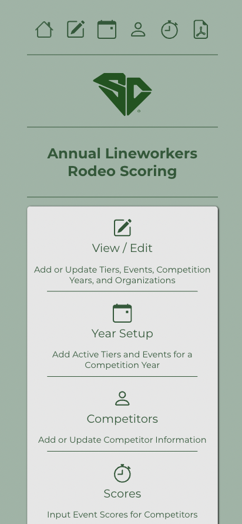
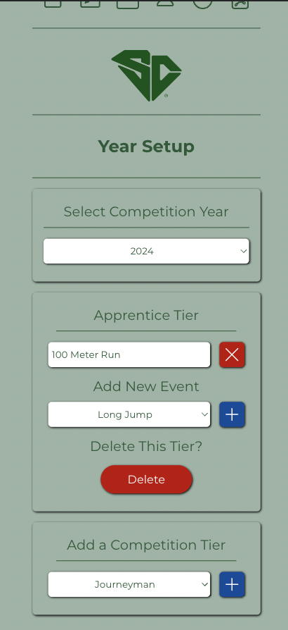
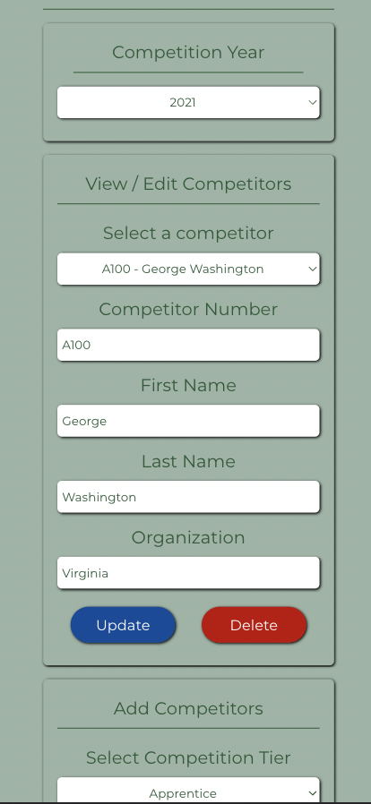
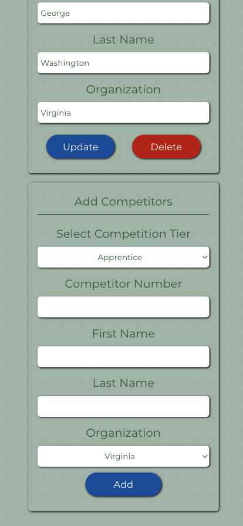
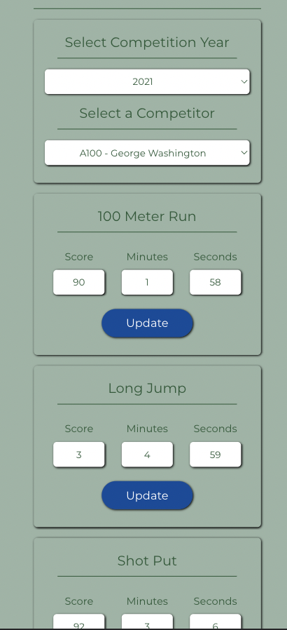
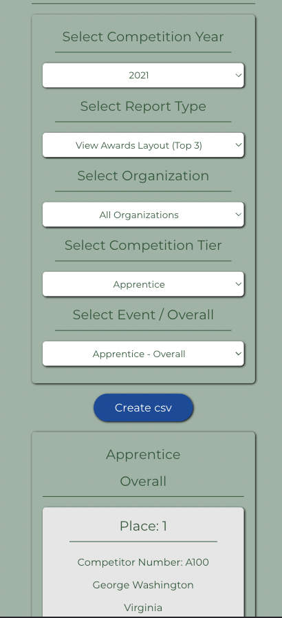
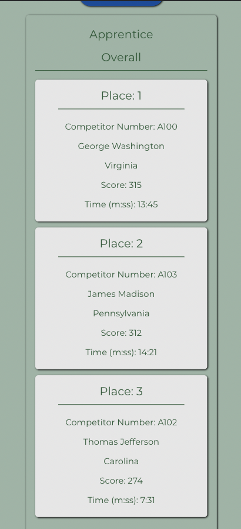
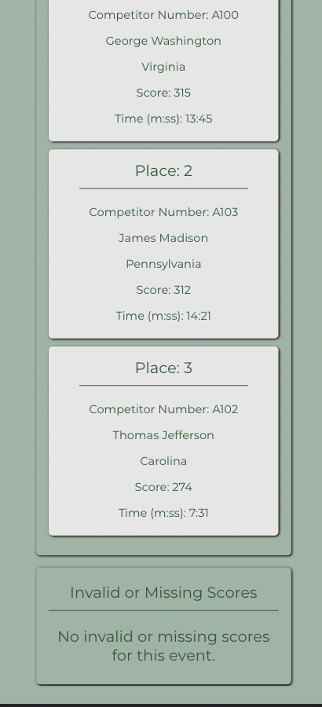

# Annual Lineworkers Rodeo Scoring App

This project was designed to handle the scoring, ranking, and reporting for a regional competition testing Lineworker skills. The design intent was to provide a method for event support staff to upload score data to a single database using their mobile devices during the event. The competition consists of multiple competition tiers. Each tier could consist of individuals or teams and each tier is tested on different events. All events are scored and timed. A final report ranks competitors by score with ties broken by the faster event time. Reports can be filtered by tier, event, and organization. 

<https://rodeo-scoring-a2ab81b5285f.herokuapp.com/>

## Requirements

This project is compatible with all modern web browsers.

## Technology/Framework

The Annual Lineworkers Rodeo Scoring App is a React Single Page Application (SPA) served by a Node Express server and a MongoDB database. This project is hosted as a combined SPA on Heroku. 

## How to Use

Access the app using the link above. This app also supports being installed as a Progressive Web App (PWA) on iOS and Android devices. You can navigate to the various pages using the navbar at the top or the nav menu on the Home page.

### Adding Items

Navigate to the View page. Select the "Year" category and add the year for your competition at the bottom. Next, select the "Tier" category and add all applicable competition tiers. Next, select the "Event" category and add all events for the competition. Finally, select the "Organization" category and add all participating organizations. Items can be updated using the blue update button next to the item. Items can be deleted by using the red delete button next to each item.

### Year Setup

Navigate to the Year page. Select the applicable year for the competition. Add all applicable competition tiers by selecting each from the dropdown menu at the bottom of the page and clicking the blue add button. After each competition tier is added, add the applicable events for each competition tier. Events and tiers can be deleted using the appropriate delete buttons.

### Adding Competitors

Navigate to the Competitor page. Select the applicable year for the competition. Add competitors at the bottom of the page by selecting the appropriate competition tier and organization from the dropdown menus, entering the applicable name and number fields, and clicking the blue add button. After competitors are added, their information can be viewed and updated using the dropdown menu at the top of the page.

### Adding Scores

Navigate to the Score page. Select the applicable year for the competition, then select the applicable competitor. Enter or update the event scores and times and click the blue update button to update the values for each event. 

### Generating Reports

Navigate to the Report page. Reports for each event are displayed on this page and can be downloaded as a csv file. To display a report, select the applicable competition year, tier, and event. Reports can be filtered to show all competitors, just the top 3 competitors, all organizations, or a single organization, 

## Upcoming Improvements

- Refactoring report page to reduce the number of server requests
- Improving data validation for input fields
- Adding realtime user feedback to input fields 
- Adding ability to download a pdf version of each report

## License

Released under MIT License

Copyright (c) 2023 Jason Mangin

Permission is hereby granted, free of charge, to any person obtaining a copy of this software and associated documentation files (the "Software"), to deal in the Software without restriction, including without limitation the rights to use, copy, modify, merge, publish, distribute, sublicense, and/or sell copies of the Software, and to permit persons to whom the Software is furnished to do so, subject to the following conditions:

The above copyright notice and this permission notice shall be included in all copies or substantial portions of the Software.

THE SOFTWARE IS PROVIDED "AS IS", WITHOUT WARRANTY OF ANY KIND, EXPRESS OR IMPLIED, INCLUDING BUT NOT LIMITED TO THE WARRANTIES OF MERCHANTABILITY, FITNESS FOR A PARTICULAR PURPOSE AND NONINFRINGEMENT. IN NO EVENT SHALL THE AUTHORS OR COPYRIGHT HOLDERS BE LIABLE FOR ANY CLAIM, DAMAGES OR OTHER LIABILITY, WHETHER IN AN ACTION OF CONTRACT, TORT OR OTHERWISE, ARISING FROM, OUT OF OR IN CONNECTION WITH THE SOFTWARE OR THE USE OR OTHER DEALINGS IN THE SOFTWARE.