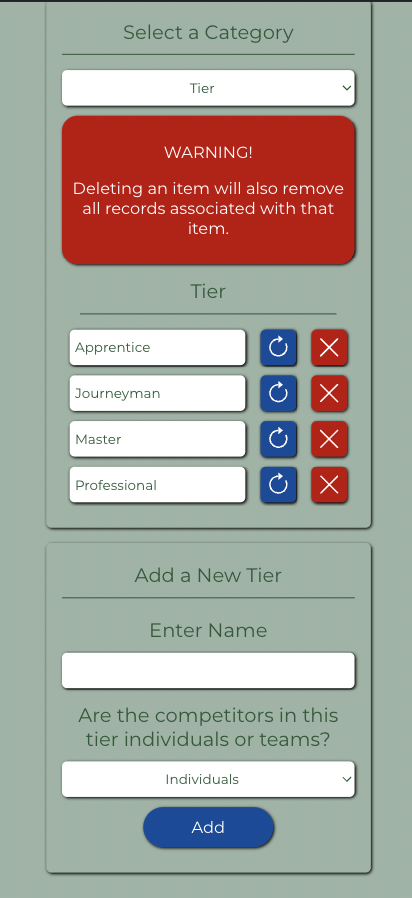

# Annual Lineworkers Rodeo Scoring App

This project was designed to handle the scoring, ranking, and reporting for a regional competition testing Lineworker skills. The competition consists of multiple competition tiers. Each tier could consist of individuals or teams and each tier is tested on different events. All events are scored and timed. A final report ranks competitors by score with ties broken by the faster event time. Reports can be filtered by tier, event, and organization.

<https://rodeo-scoring-a2ab81b5285f.herokuapp.com/>

## Requirements

This project is compatible with all modern web browsers.

## Technology/Framework

The Annual Lineworkers Rodeo Scoring App is a React Single Page Application (SPA) served by a Node Express server and a MongoDB database. This project is hosted as a combined SPA on Heroku. 

## How to Use

This project consists of 3 pages:

"About Me" (index.html)
This page contains my picture and a short description of my background.

"Portfolio (portfolio.html)
This page contains links to a few of my projects.

"Contact Me" (contact.html)
This page contains a contact form to allow you to send me a message.

## License

Released under MIT License

Copyright (c) 2023 Jason Mangin

Permission is hereby granted, free of charge, to any person obtaining a copy of this software and associated documentation files (the "Software"), to deal in the Software without restriction, including without limitation the rights to use, copy, modify, merge, publish, distribute, sublicense, and/or sell copies of the Software, and to permit persons to whom the Software is furnished to do so, subject to the following conditions:

The above copyright notice and this permission notice shall be included in all copies or substantial portions of the Software.

THE SOFTWARE IS PROVIDED "AS IS", WITHOUT WARRANTY OF ANY KIND, EXPRESS OR IMPLIED, INCLUDING BUT NOT LIMITED TO THE WARRANTIES OF MERCHANTABILITY, FITNESS FOR A PARTICULAR PURPOSE AND NONINFRINGEMENT. IN NO EVENT SHALL THE AUTHORS OR COPYRIGHT HOLDERS BE LIABLE FOR ANY CLAIM, DAMAGES OR OTHER LIABILITY, WHETHER IN AN ACTION OF CONTRACT, TORT OR OTHERWISE, ARISING FROM, OUT OF OR IN CONNECTION WITH THE SOFTWARE OR THE USE OR OTHER DEALINGS IN THE SOFTWARE.